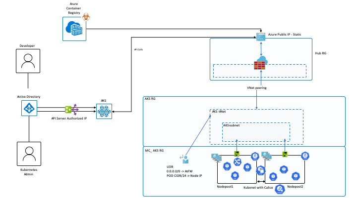

# AKS Secure Template


## Description

Description of the project ...

## Features

This Terraform module will deploy the following resources:

* Azure Resource Group for AKS with the following resources

  * AKS Object
  * VNet defaulting to 10.10.0.0/16 with a single subnet for AKS 10.10.1.0/24
  * VNet peered to hub vnet
  * 2 node Pools that can be named by using variables with Cluster Autoscaling enabled for each node pool based on true or false and min max for each pool

* Resource Group for AZ Firewall and hub Vnet

  * Azure Firewall configured with allow rules for Restricted egress as outlined in <https://docs.microsoft.com/en-us/azure/aks/limit-egress-traffic>
  * Static Public IP for Azure Firewall with DNS name assigned
  * Vnet with 10.0.0.0/16 CDIR with subnet 10.0.1.0/24 for the internal interface of the Azure Firewall
  * Vnet peering to AKS VNet

* AKS is deployed with the security features:

  * Pod Security Policy(Preview)
  * Calico Network Policy Module
  * Kubernetes Service CIDR of 172.16.0.0/16, DNS IP of 172.16.0.10 and Docker Bride CIDR of 172.17.0.1/16. Azure CNI uses the Azure subnet for PodCIDR and kubenet uses a Pod CIDR of 172.18.0.0/16
  * Restricted Egress traffic as outlined in <https://docs.microsoft.com/en-us/azure/aks/limit-egress-traffic>
  * API server authorized IP Whitelisting as described in <https://docs.microsoft.com/en-us/azure/aks/api-server-authorized-ip-ranges>
  * (Optional) Azure AD integrated RBAC as outlined in <https://docs.microsoft.com/en-us/azure/aks/azure-ad-integration>
  * The AKS Created UDR for kubenet is updated with a new route of 0.0.0.0/0 to the internal IP of the AZ Firewall in the peered hub Vnet and assigned to the AKS subnet. With AzureCNI a new UDR is placed on the Auzre Subnet that also directs traffic to the internal Private IP of the Azure Firewall.



The following values can be used for a `terraform.tfvars`

azfw tfvars

```hcl
CLUSTER_ID="RCNP-tstsplit1"
COST_CENTER="8765"
DEPLOY_TYPE="dev"
ENVIRONMENT="dev-infosec"
NOTIFY_LIST="it_ops@mycomp.com"
OWNER_INFO="IT_OPS"
PLATFORM="RCNP-K8S"
SPONSOR_INFO="it_ops"
REGION="southcentralUS"
DOCKER_REGISTRY="myreg.azurecr.io"
#Must create SP with Subscription Contributor Rights to run TF with
TF_CLIENT_ID="<SP_APPID_WITH_CONTRIBUTOR_ONSUBSCRIPTION_OR_RG>"
TF_CLIENT_SECRET="<SP_SECRET>"
TF_TENANT_ID="<AZURE_TENANT_ID>"
TF_SUB_ID="<AZURE_SUB_ID>"
#Must Create Log Anayltics workspace prior to deployment
LOG_ANALYTICS_WORKSPACE_NAME="<LOG_ANALYTICS_WORKSPACE_NAME>"
LOG_ANALYTICS_WORKSPACE_RG="<REGION_LOG_ANALYTICS_WORKSPACE_IS_LOCATED"
```

aks tfvars

```hcl
CLUSTER_ID="RCNP-tstsplit1"
COST_CENTER="8765"
DEPLOY_TYPE="dev"
ENVIRONMENT="dev-infosec"
NOTIFY_LIST="it_ops@mycomp.com"
OWNER_INFO="IT_OPS"
PLATFORM="RCNP-K8S"
SPONSOR_INFO="it_ops"
REGION="southcentralUS"
AKS_SSH_ADMIN_KEY="ssh-rsa AAAAB3N.........n0BCv4j0U/gZVoAX8z user@local.local"
ADMIN_USER="ejvuser"
NODE_COUNT="1"
NODE_SIZE="Standard_D2s_v3"
K8S_VER="1.13.10"
VNET_NAME="aks-vnet"
AAD_CLIENTAPP_ID="<APPID_FOR_AAD_CLIENT_SP>"
AAD_SERVERAPP_ID="<APPID_FOR_AAD_SERVER_SP>"
AAD_SERVERAPP_SECRET="<APPID_SECRET_FOR_AAD_SP>"
AUTH_IP_RANGES="100.100.0.0/14,72.183.132.114/32,184.185.0.0/16"
DOCKER_REGISTRY="ejvlab.azurecr.io"
POD_CIDR="172.18.0.0/16"
POOL1_NAME="istiopool"
POOL1_MIN="1"
POOL1_MAX="5"
POOL2_NAME="workerpool"
POOL2_MIN="1"
POOL2_MAX="5"
ENABLE_CA_POOL1="true"
ENABLE_CA_POOL2="true"
K8S_SP_CLIENT_ID="<SP_APPID_WITH_ATLEAST_NETWORK_CONTRIBUTOR_ON_RG>"
K8S_SP_CLIENT_SECRET="<SP_SECRET>"
TF_CLIENT_ID="<SP_APPID_WITH_CONTRIBUTOR_ONSUBSCRIPTION_OR_RG>"
TF_CLIENT_SECRET="<SP_SECRET>"
TF_TENANT_ID="<AZURE_TENANT_ID>"
TF_SUB_ID="<AZURE_SUB_ID>"
#below variables are the outout of the AZFW terraform build. They can be used for multiple cluster built to be spokes of the specific Azure Firewall Hub
HUBFW_NAME="hubazfw"
HUBFW_RG_NAME="<RG_NAME_RETURNED_FROM_AZFW_OUTPUT>"
HUBFW_VNET_NAME="hubvnet"
AZFW_PIP="<PUB_IP_RETURN_FROM_AZFW_OUTPUT>"
```

The following Values can also be called in the `terraform.tfvars` but they are defaulted in the `variables.tf` file (default values shown):

```hcl
VNET_ADDR_SPACE="10.10.0.0/16"
DNS_SERVERS=[]
SUBNET_NAMES=["aks-subnet"]
SUBNET_PREFIXES=["10.10.1.0/24"]
SERVICE_CIDR="172.16.0.0/16" #Used to assign internal services in the AKS cluster an IP address. This IP address range should be an address space that isn't in use elsewhere in your network environment. This includes any on-premises network ranges if you connect, or plan to connect, your Azure virtual networks using Express Route or a Site-to-Site VPN connections
DNS_IP="172.16.0.10" #should be the .10 address of your service IP address range
DOCKER_CIDR="172.17.0.1/16" #IP address (in CIDR notation) used as the Docker bridge IP address on nodes. Default of 172.17.0.1/16.
VDMZ_VNET_NAME="vDMZ-Vnet-hub"
```

>NOTE: When using Kubenet, to completely finish the build out, remove the temporary network filter rule which was scoped to the entire region instead of the specific API IP from the azure firewall.

## Prerequisites

* Azure subscription with permissions to create:
  * Resource Groups, AKS, Event Hubs, Storage accounts, Azure Firewall and Network Operations.
* Bash shell (tested on Mac, Ubuntu, Windows with WSL2)
  * Will work in Cloud Shell

* Azure CLI 2.0.72+ ([download](https://docs.microsoft.com/en-us/cli/azure/install-azure-cli?view=azure-cli-latest))
* Visual Studio Code (optional) ([download](https://code.visualstudio.com/download))
* Terraform 0.11.14

## Documentation

* Table of contents is at [docs/index.md](docs/index.md)

## Contributing

This project welcomes contributions and suggestions. Most contributions require you to agree to a
Contributor License Agreement (CLA) declaring that you have the right to, and actually do, grant us
the rights to use your contribution. For details, visit [Microsoft Contributor License Agreement](https://cla.opensource.microsoft.com).

When you submit a pull request, a CLA bot will automatically determine whether you need to provide
a CLA and decorate the PR appropriately (e.g., status check, comment). Simply follow the instructions
provided by the bot. You will only need to do this once across all repos using our CLA.

This project has adopted the [Microsoft Open Source Code of Conduct](https://opensource.microsoft.com/codeofconduct/).
For more information see the [Code of Conduct FAQ](https://opensource.microsoft.com/codeofconduct/faq/) or
contact [opencode@microsoft.com](mailto:opencode@microsoft.com) with any additional questions or comments.
